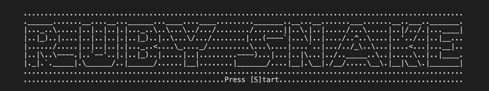

# Snake Game

The classic snake game developed using the ruby programming language. Based on [this tutorial](https://diatomenterprises.com/gamedev-on-ruby-why-not/).



## Running
```
ruby start_game.rb
```

Press `q` to quit the game, or press `ctrl+c` to terminate the program
